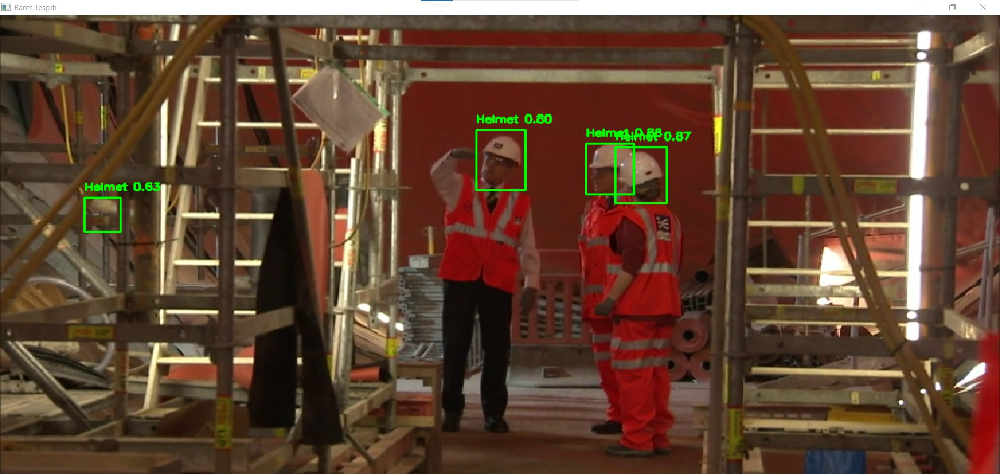
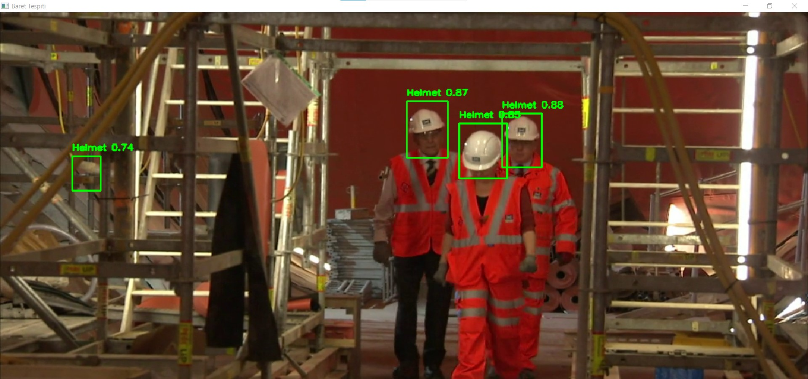
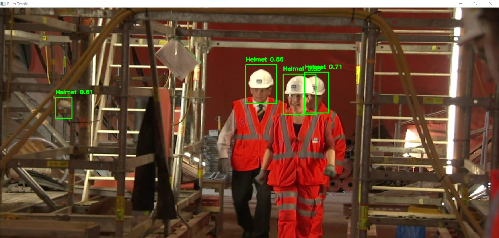
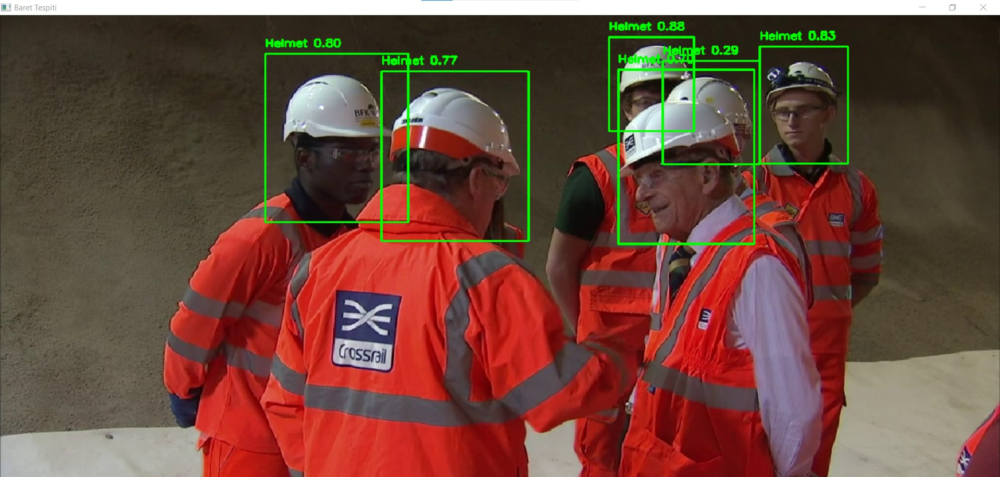

 

## Baret (Kask) Tespiti - YOLOv8 ONNX ve OpenCV ile Gerçek Zamanlı Kask Tespiti 
 
Bu proje, YOLOv8 modelinin ONNX formatına dönüştürülmüş hali ile video akışında veya canlı kamerada gerçek zamanlı olarak baret (kask) tespiti yapmaktadır. Tespit edilen baretler, OpenCV kullanılarak ekranda kare içine alınır ve üzerinde güven skorları gösterilir. 
 
 
## Proje Hakkında 
 
  Baret takmayan çalışanların tespiti gibi iş güvenliği senaryolarında kullanılabilir. 
- Model, YOLOv8 mimarisiyle eğitilmiş ve ONNX formatında kullanıma hazır hale getirilmiştir. 
- ONNX modeli, OpenCV’nin `dnn` modülüyle çalıştırılır ve video kareleri üzerinde gerçek zamanlı tespit yapılır. 
- Hem **kayıtlı video** hem de **canlı kamera yayını** üzerinden çalışabilir. 
 
 
 
## Dosya ve Klasörler 
 
- `detect_helmet.py` : Ana Python betiği, baret tespitini yapar ve sonuçları ekrana yansıtır. 
- `best.onnx` : YOLOv8 tabanlı eğitimli ONNX modeli. 
- `helmet_video.mp4` : Test için kullanılacak örnek video dosyası. 
- `README.md` : Projeyi açıklayan bu dosya. 
 
 
## Gereksinimler 
 
Bu projeyi çalıştırmak için aşağıdaki yazılımlar gereklidir: 
 
- Python 3.8 veya üstü 
- OpenCV 
- NumPy 
 
Kurulum için terminal veya komut satırından şunu çalıştırabilirsiniz: 
 
pip install opencv-python numpy 
  

 

 ## Ayarlar 

detect_helmet.py içinde değiştirmeniz gerekebilecek bazı parametreler: 

MODEL_PATH: ONNX model dosyasının yolu. 

VIDEO_PATH: Kullanmak istediğiniz video dosyasının yolu. 

Örneğin: 

VIDEO_PATH = "helmet_video.mp4" kullanılırsa belirttiğiniz videoyu işler. 

VIDEO_PATH = 0 yaparsanız sistem otomatik olarak bilgisayarınıza bağlı varsayılan kamerayı açar ve canlı görüntü üzerinde baret tespiti yapar. 

IMG_SIZE: Modele girecek resimlerin yeniden boyutlandırılacağı kare boyutu (640x640 varsayılan). 

CONF_TH: Tespit için minimum güven skoru eşiği (varsayılan 0.25). 

IOU_TH: NMS için IoU eşiği (varsayılan 0.45). 

fps_limit: Saniyede işlenecek maksimum kare sayısı (donanımınıza göre ayarlayabilirsiniz). 

 

## Çalıştırma 

Terminal veya komut satırında proje klasörüne gidip aşağıdaki komutu yazın: 

python detect_helmet.py 
  

Program açıldıktan sonra Baret Tespiti isimli bir pencere göreceksiniz. 

Program çalışırken videodaki veya kameradaki baretli kişiler kare içine alınır ve üzerinde "Helmet 0.xx" şeklinde güven skoru yazdırılır. 

Programı kapatmak için pencere aktifken Q tuşuna basabilirsiniz. 

 

## Kodun Çalışma Mantığı 

Video dosyası veya canlı kamera kare kare okunur. 

️Her kare: 

letterbox fonksiyonu ile orantılı şekilde yeniden boyutlandırılır ve modele uygun hale getirilir. 

Karelerden blob oluşturulup modele beslenir. 

Model çıktısı işlenir, belirlenen sınıf kimliği (HELMET_ID=1) ve güven eşiğine göre filtreleme yapılır. 

Geçerli tespitler için NMS (Non-Maximum Suppression) uygulanır. 

 

Son olarak tespit edilen baretler yeşil dikdörtgenlerle işaretlenir ve skor etiketi ekranda gösterilir. 

 

## Kullanım Notları 

Modelin tespit ettiği sınıf kimliği (class id) 1 numaralı baret sınıfına özeldir. Başka nesneler için farklı eğitim ve ayar gereklidir. 

Model ve video dosyasının yolu, kendi dosya dizininize göre doğru şekilde ayarlanmalıdır. 

 VIDEO_PATH=0 yaparak bilgisayarınızdaki kameradan canlı tespit yapabilirsiniz. 

 Donanımınızın performansına bağlı olarak fps_limit değerini düşürüp/yükselterek akıcılığı ayarlayabilirsiniz. 

 

## Örnek Ekran Çıktıları 

Aşağıda proje çalıştırıldığında alınan örnek çıktılardan bazıları gösterilmektedir: 

Örnek 1 

 

Örnek 2 

 

Örnek 3 

 

Örnek 4 

 

 
